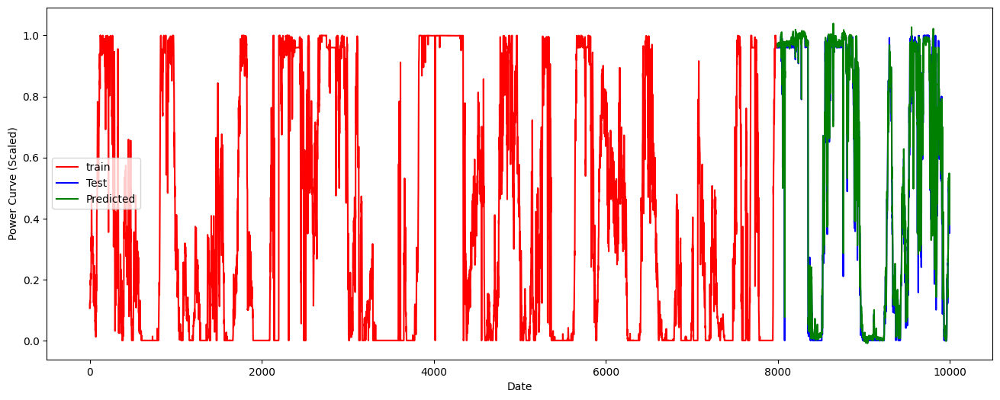

# 

    

<h1 align="center">
    
Wind Energy Production Forecasting with Multivariable LSTM Networks

</h1>

# Introduction:

The intermittent nature of wind energy poses significant challenges for reliable power production and grid integration. To address this, we are developing an advanced time series forecasting model using multivariant Long Short-Term Memory (LSTM) networks. This project aims to accurately predict wind energy production for the next 24 to 72 hours at hourly or 20-minutes intervals, based on historical wind speed and meteorological data. By enhancing forecast accuracy, we seek to improve the efficiency and reliability of wind energy resources, ultimately enabling better grid management and reducing energy curtailment.

# Methodology:

The LSTM model is depending on several features that incorporate with the model,

    

For a multivariate LSTM model, feature importance becomes even more critical because the model depends on multiple interrelated features to make predictions. The multivariate nature adds complexity since the importance of a feature may depend not only on its direct contribution but also on its interaction with other features over time.

## Data set that used in the project:

The dataset used in this project is sourced from the Wind Turbine Scada Dataset available on [Kaggle](https://www.kaggle.com/datasets/berkerisen/wind-turbine-scada-dataset). This dataset contains SCADA (Supervisory Control and Data Acquisition) data collected from wind turbines, including various parameters such as wind speed, wind direction, and power output. The data is recorded at 10-minute intervals, providing a comprehensive view of the turbine's performance over time. This rich dataset is instrumental in training the LSTM model to predict wind energy production accurately.

    

# Results:

R² score of 0.9614 means that 96.14% of the variance in the target variable is explained by the model, indicating a very strong fit.

    

The model is capable of impressive MSE and MAE. So, Very low MSE (Mean Squared Error) and MAE (Mean Absolute Error) values indicate that the model's predictions are highly accurate, with minimal deviation from the actual target values.

- **[Scaled] Mean Squared Error (MSE):**  0.00657
- **[Scaled] Mean Absolute Error (MAE):** 0.04193

Low values for both metrics reflect strong model performance.

- **Mean Squared Error (MSE):** 85537.77
- **Mean Absolute Error (MAE):** 151.31

The below graph conforms the model performance.

#### Training Graphs:

    

#### Test Data for Model Training:

    

#### Overlay of Test and Predicted Data:

    

The above graph shows that the predicted targets align closely with the actual targets.  So, it is evident that model is capable of handling live information for get reliable predictions.

Wind Speed was identified as the most critical factor, showing a direct proportional relationship with energy output. Three significant data gaps were identified in the dataset, requiring careful handling during model training. The analysis also revealed the need to aggregate data to hourly and 10-minutes intervals for consistent predictions.

    

---
